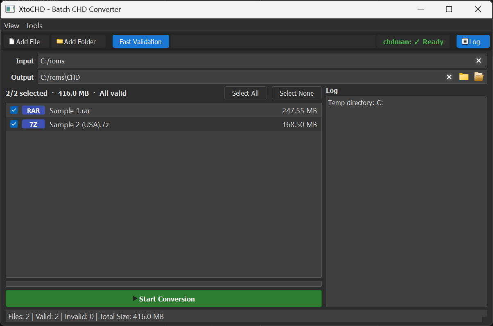

# XtoCHD

A powerful GUI application to convert disk images to CHD format using chdman with advanced features and comprehensive statistics.



## What is XtoCHD?

XtoCHD helps you convert various disk image formats (like .cue, .bin, .iso, .img, .zip) to .CHD format. This is useful for retro gaming and emulation. The application provides a user-friendly interface with advanced features for batch processing and detailed conversion reporting.

## Download

### For End Users (No Installation Required)
1. Download the latest release from the [Releases](https://github.com/yourusername/XtoCHD/releases) page
2. Extract the ZIP file
3. Double-click `XtoCHD.exe` to run (chdman.exe is included)

### For Developers
1. Clone this repository
2. Install Python 3.7+
3. Install dependencies: `pip install -r requirements.txt`
4. Run: `python main.py`

## How to Use

1. **Select Input**: Choose a file or folder containing disk images
2. **Select Output**: Pick where to save the converted .CHD files (auto-suggests `[input]/CHD/`)
3. **Set chdman Path**: The app will auto-detect `chdman.exe` if it's in the same folder, or you can manually browse to it
4. **Scan Files**: Click "Scan for Files" to find compatible images (duplicates are automatically handled)
5. **Select Files**: Check/uncheck which files to convert
6. **Start Conversion**: Click "Start Conversion" and monitor progress
7. **Stop if Needed**: Use the "Stop Conversion" button to cancel at any time
8. **Review Results**: Check the comprehensive conversion summary at the end

## Supported Formats

- **Input**: .cue, .bin, .iso, .img, .zip
- **Output**: .CHD

## Requirements

- Windows 10/11
- No Python installation needed for the executable
- chdman.exe is included in the release (from MAME project)

## Features

### 🎯 Smart Processing
- **Format Prioritization**: Automatically selects the best format when duplicates exist
- **Existing File Detection**: Skips files that already have CHD versions
- **Batch Processing**: Convert multiple files or entire folders at once
- **ZIP Support**: Extract and convert files from ZIP archives

### 📈 Comprehensive Reporting
- **Success Rate**: Shows percentage of successful conversions
- **Size Analysis**: Original vs compressed file sizes
- **Space Savings**: Total space saved and compression ratios
- **Detailed Lists**: Complete breakdown of all processed files

### 🎮 User-Friendly Interface
- **Real-time Progress**: Live status updates and progress tracking
- **Intuitive Controls**: Easy-to-use interface with clear feedback
- **Error Handling**: Clear error messages and recovery options
- **Responsive Design**: UI remains responsive during long conversions

### 🔧 Advanced Features
- **Stop Conversion**: Cancel running conversions with proper cleanup
- **Auto-suggest Output**: Automatically suggests output folder location
- **Smart Duplicate Detection**: Handles multiple formats of the same content
- **Enhanced ZIP Support**: Smart extraction with existing file detection

## 🚧 Upcoming / In Development

A new **Advanced File Management** system is currently in development and will be available in a future release. Highlights include:

- Modern popup dialog for advanced settings, with clear grouping and improved usability
- Clickable placeholders for custom naming schemes (insert at cursor)
- Live-updating example for naming scheme and organization path as you edit
- Master enable/disable checkbox to turn all advanced file management features on or off at once
- All advanced features are **off by default** and must be enabled by the user
- See [CHANGELOG.md](CHANGELOG.md) for full details

**What is the Advanced File Management system?**

This system lets you automatically organize, rename, and sort your converted CHD files based on game system, region, and title. You can:

- **Customize file names** using placeholders like `[System]`, `[Title]`, `[Region]`, and `[Original]`.
  - *Example*: If you set the naming scheme to `[System] [Title] (Region)`, a file might be named `PlayStation Final Fantasy VII (USA).chd`.
- **Organize output folders** by system and region.
  - *Example*: With both options enabled, a file could be saved as `Output/PlayStation/USA/Final Fantasy VII.chd`.

These features are optional and designed for users who want more control over how their converted files are named and organized. By default, advanced file management is off, so the app works simply unless you enable these options.

*Note: These features are not yet released and are subject to change before the next version.*

## Building from Source

### For Developers
```bash
# Install dependencies
pip install -r requirements.txt

# Run the application
python main.py
```

### Building Executable
```bash
# Install dependencies
pip install -r requirements.txt

# Build executable
python build_exe.py
```

### Windows Users
Simply double-click `build.bat` to build the executable automatically.

The executable will be created in the `dist/` folder as `XtoCHD.exe`.

**Note**: The build process will include chdman.exe in the distribution.

## Credits

This application relies on **chdman** from the [MAME project](https://www.mamedev.org/). Special thanks to the MAME development team for creating and maintaining this essential tool.

- **chdman**: Part of the MAME project - [GitHub](https://github.com/mamedev/mame)
- **MAME**: Multiple Arcade Machine Emulator

**Note**: chdman.exe is included in this distribution for user convenience. It is free software from the MAME project and is used in accordance with their license terms.

## License

This project is licensed under the MIT License - see the [LICENSE](LICENSE) file for details.

## Contributing

1. Fork the repository
2. Create a feature branch
3. Make your changes
4. Submit a pull request

## Support

If you encounter issues:
1. Ensure your input files are valid
2. Check the conversion summary for detailed error information
3. Create an issue on GitHub with details 