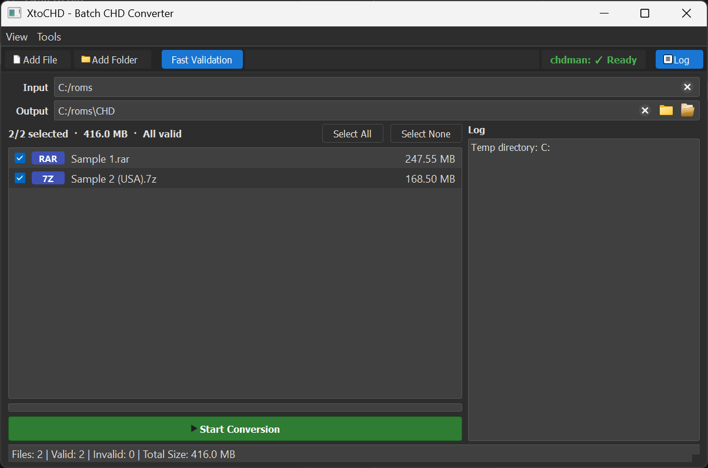

# XtoCHD

A GUI application to convert disk images to CHD format using chdman with advanced features and comprehensive statistics.



## What is XtoCHD?

XtoCHD helps you convert various disk image formats (like .cue, .bin, .iso, .img, .zip, .rar, .7z) to .CHD format. This is useful for retro gaming and emulation. The application provides a user-friendly interface with advanced features for batch processing and detailed conversion reporting.

## Download

### For End Users (No Installation Required)
1. Download the latest release ZIP file from the [Releases](https://github.com/Xplizet/XtoCHD/releases) page
2. Extract the ZIP file to any folder
3. Double-click `XtoCHD.exe` to run (chdman.exe is included in the release)

### For Developers
1. Clone this repository
2. Install Python 3.7+
3. Install dependencies: `pip install -r requirements.txt`
4. Run: `python main.py`

## Windows Defender False Positive

**⚠️ Important**: Some antivirus software, including Windows Defender, may flag XtoCHD as a potential threat. This is a **false positive**.

### Why This Happens
- **Heuristic Detection**: Antivirus software uses machine learning to detect patterns that might indicate threats
- **File Operations**: XtoCHD performs many file operations (reading, writing, extracting ZIPs) which can trigger security heuristics
- **Subprocess Calls**: The app calls external programs (`chdman.exe`) which can look suspicious to antivirus software
- **Python Packaging**: Compiled Python applications often trigger false positives

### This is NOT a Virus
XtoCHD is **completely safe**:
- ✅ **Open Source**: Code is publicly available on GitHub
- ✅ **No Network Activity**: App doesn't connect to the internet
- ✅ **Local Only**: All operations performed on your local files
- ✅ **No Data Collection**: App doesn't send any data anywhere
- ✅ **File Operations Only**: Only reads/writes files you specify

### How to Handle This

#### Option 1: Add Exception (Recommended)
1. Open Windows Security
2. Go to "Virus & threat protection"
3. Click "Manage settings" under "Virus & threat protection settings"
4. Scroll down to "Exclusions"
5. Add the XtoCHD folder as an exclusion

#### Option 2: Run from Source
If you're concerned, run the Python source directly:
```bash
python main.py
```

### Why This is Common
Many legitimate software tools get false positives:
- **7-Zip** (file compression)
- **AutoHotkey** (automation)
- **Python applications** (especially when packaged)
- **Game modding tools**
- **File conversion utilities**

The application is completely safe to use. This is a known issue with antivirus software and Python applications.

## How to Use

1. **Select Input**: Choose a file or folder containing disk images, or drag and drop files/folders directly onto the application
2. **Select Output**: Pick where to save the converted .CHD files (auto-suggests `[input]/CHD/`)
3. **Set chdman Path**: The app will auto-detect `chdman.exe` if it's in the same folder, or you can manually browse to it
4. **Configure Validation**: Use the "Fast Validation Mode" toggle to choose between fast (5-10x faster) or thorough validation
5. **Scan Files**: Files are automatically scanned when you select input (scanning runs in background for better responsiveness)
6. **Review Validation**: Check file validation status with visual indicators (✓ for valid, ✗ for invalid)
7. **Select Files**: Check/uncheck which files to convert (file sizes are displayed for reference)
8. **Start Conversion**: Click "Start Conversion" and monitor progress
9. **Stop if Needed**: Use the "Stop Conversion" button to cancel at any time
10. **Review Results**: Check the comprehensive conversion summary at the end
11. **View Output**: Use the "Open Output Folder" button to quickly access your converted files

## Temp File Management

XtoCHD includes a comprehensive temp file management system to ensure clean operation:

### Automatic Cleanup
- **Dedicated Temp Directory**: All temp files stored in `[XtoCHD_directory]/temp/`
- **Crash-Proof Cleanup**: Automatic cleanup even if the application crashes
- **Startup Cleanup**: Removes orphaned temp files on application startup
- **Per-File Cleanup**: Temp files cleaned up after each individual conversion

### Manual Management
- **Tools Menu**: Access "Temp Directory Info" and "Clean Temp Directory" options
- **Size Monitoring**: Automatic warnings for large temp directories (>100MB)
- **Status Logging**: Clear logging of temp directory operations and cleanup

### Crash Handling
- **Automatic Cleanup**: Temp files are automatically cleaned up on next startup
- **Age-Based Cleanup**: Removes temp directories older than 1 hour
- **Process Tracking**: Unique temp directory names prevent conflicts

## Supported Formats

- **Input**: .cue, .bin, .iso, .img, .gdi, .toc, .ccd, .zip, .rar, .7z
- **Output**: .CHD

Archive handling:
- `.zip` is read with Python's standard library.
- `.rar` and `.7z` are extracted via the bundled `bsdtar` (libarchive) that ships with Windows 10 1803 and later at `C:\Windows\System32\tar.exe`. No extra third-party binary is installed.

## Requirements

- Windows 10 1803 or later (required for built-in `.rar` / `.7z` extraction) or Windows 11
- No Python installation needed for the executable
- chdman.exe is included in the release (from MAME project)

## Features

### 🎯 Smart Processing
- **Format Prioritization**: Automatically selects the best format when duplicates exist
- **Existing File Detection**: Skips files that already have CHD versions
- **Batch Processing**: Convert multiple files or entire folders at once
- **Smart Duplicate Detection**: Handles multiple formats of the same content
- **Archive Support**: Extracts and converts disc images from .zip, .rar, and .7z archives, with a sibling-index filter so chdman is never handed a bare track file when a .cue or .gdi is available alongside it

### 📈 Comprehensive Reporting
- **Success Rate**: Shows percentage of successful conversions
- **Size Analysis**: Original vs compressed file sizes with space savings
- **Detailed Lists**: Complete breakdown of all processed files
- **File Size Display**: Shows file sizes in the conversion list

### 🎮 User-Friendly Interface
- **Real-time Progress**: Live status updates and progress tracking
- **Intuitive Controls**: Easy-to-use interface with clear feedback
- **Error Handling**: Clear error messages and recovery options
- **Responsive Design**: UI remains responsive during long conversions
- **Drag & Drop**: Support for dragging files and folders directly onto the application
- **Background Scanning**: File scanning runs in background threads for better responsiveness
- **Theme Support**: Light and dark themes with automatic UI adaptation
- **File Validation**: Real-time file validation with visual status indicators
- **Fast Validation Mode**: Toggle between fast (5-10x faster) and thorough validation

### 🔧 Convenience Features
- **Stop Conversion**: Cancel running conversions with proper cleanup; the Stop button kills the running chdman process tree, not just a flag
- **Auto-suggest Output**: Automatically suggests output folder location
- **Open Output Folder**: Quick access to view converted files
- **Auto-scrolling Log**: Log area automatically scrolls to show latest messages
- **File Information Panel**: Detailed file information with validation status
- **Automatic chdman Detection**: Real-time detection of chdman.exe presence
- **Temp File Management**: Dedicated temp directory with automatic cleanup and crash recovery
- **Tools Menu**: Manual temp directory cleanup and monitoring options
- **Remembers Last Folders**: Input and output paths are persisted across runs, and the log splitter keeps whatever width you dragged it to

## Project Structure

```
main.py                 Entry point and CHDConverterGUI main window
xtochd/
  constants.py          Extension sets and format-priority tables
  stats.py              ConversionStats dataclass
  temp_manager.py       Crash-proof temp directory management
  theme.py              Light/dark Qt stylesheets
  validators.py         Per-format validation and the conversion-candidate filter
  workers.py            QThread workers: ConversionWorker, ScanWorker, ValidationWorker
tests/
  test_filter_candidates.py
  test_validators.py
  test_temp_manager.py
  test_stats.py
```

The `main.py` entry point keeps the same file name and responsibilities as before so `build_exe.py` and `build.bat` still work without changes.

## Testing

A pytest suite covers the pure helpers: the conversion-candidate filter, every per-format validator, the temp-directory lifecycle, and the `ConversionStats` math. To run it:

```bash
pip install -r requirements-dev.txt
python -m pytest
```

The full suite runs in well under a second and does not require PyQt or chdman to be present.

## Building from Source

### For Developers
```bash
# Install dependencies
pip install -r requirements.txt

# Run the application
python main.py
```

### Building Executable
```bash
# Install dependencies
pip install -r requirements.txt

# Build executable
python build_exe.py
```

### Windows Users
Simply double-click `build.bat` to build the executable automatically.

The executable will be created in the `dist/` folder as `XtoCHD.exe`.

**Note**: The build process will include chdman.exe in the distribution.

## Credits and chdman Licensing

This application relies on **chdman** from the [MAME project](https://www.mamedev.org/). Special thanks to the MAME development team for creating and maintaining this essential tool.

- **chdman**: Part of the MAME project - [GitHub](https://github.com/mamedev/mame)
- **MAME**: Multiple Arcade Machine Emulator
- **chdman source (GPL-2.0)**: https://github.com/mamedev/mame - the full source corresponding to the bundled `chdman.exe` is available upstream at the MAME GitHub repository.

**License note**: `chdman.exe` is included in this distribution for user convenience. MAME as a whole is distributed under the GNU General Public License, version 2; see the `MAME-LICENSE.txt` file that ships next to `chdman.exe` in the release ZIP for the full terms. XtoCHD invokes chdman as a separate process rather than linking against it, so XtoCHD itself remains under the MIT License (see the [LICENSE](LICENSE) file in this repository).

## License

This project is licensed under the MIT License - see the [LICENSE](LICENSE) file for details.

## Contributing

1. Fork the repository
2. Create a feature branch
3. Make your changes
4. Submit a pull request

## Support

If you encounter issues:
1. Ensure your input files are valid
2. Check the conversion summary for detailed error information
3. Create an issue on GitHub with details 
