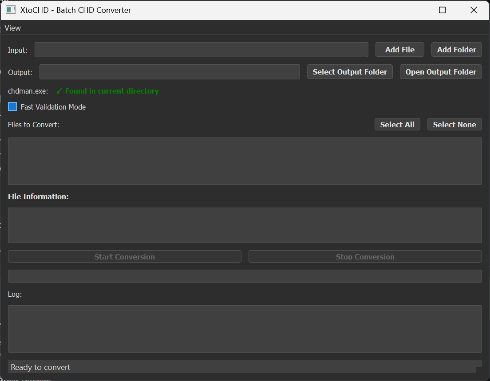

# XtoCHD v2.0.0

A powerful GUI application to convert disk images to CHD format using chdman with advanced features and comprehensive statistics.



## What is XtoCHD?

XtoCHD helps you convert various disk image formats (like .cue, .bin, .iso, .img, .zip) to .CHD format. This is useful for retro gaming and emulation. Version 2.0.0 brings significant improvements in usability, reliability, and feature set.

## ✨ New Features in v2.0.0

### 🎯 Smart File Management
- **Intelligent Duplicate Detection**: Automatically detects and prioritizes better formats (CUE > ISO > BIN > IMG)
- **Skip Existing Files**: Automatically skips conversion if CHD files already exist
- **Enhanced ZIP Support**: Smart extraction with existing file detection

### 📊 Comprehensive Statistics
- **Detailed Conversion Summary**: Shows success/failure/skip counts with percentages
- **Size Statistics**: Tracks original vs compressed sizes, space saved, and compression ratios
- **File Lists**: Complete lists of successful, failed, and skipped files

### 🎮 Improved User Experience
- **Stop Conversion**: Cancel running conversions with proper cleanup
- **Auto-suggest Output**: Automatically suggests `[input]/CHD/` as output folder
- **Status Bar**: Real-time progress messages and status updates
- **Better UI States**: Proper button enabling/disabling during conversion

### 🔧 Technical Improvements
- **Enhanced Reliability**: Improved subprocess handling and error management
- **Better Threading**: More responsive UI with proper thread management
- **Automatic Directory Creation**: Creates output directories automatically
- **Improved Error Handling**: Better error messages and user feedback

## Download

### For End Users (No Installation Required)
1. Download the latest release from the [Releases](https://github.com/yourusername/XtoCHD/releases) page
2. Extract the ZIP file
3. Double-click `XtoCHD.exe` to run (chdman.exe is included)

### For Developers
1. Clone this repository
2. Install Python 3.7+
3. Install dependencies: `pip install -r requirements.txt`
4. Run: `python main.py`

## How to Use

1. **Select Input**: Choose a file or folder containing disk images
2. **Select Output**: Pick where to save the converted .CHD files (auto-suggests `[input]/CHD/`)
3. **Set chdman Path**: The app will auto-detect `chdman.exe` if it's in the same folder, or you can manually browse to it
4. **Scan Files**: Click "Scan for Files" to find compatible images (duplicates are automatically handled)
5. **Select Files**: Check/uncheck which files to convert
6. **Start Conversion**: Click "Start Conversion" and monitor progress
7. **Stop if Needed**: Use the "Stop Conversion" button to cancel at any time
8. **Review Results**: Check the comprehensive conversion summary at the end

## Supported Formats

- **Input**: .cue, .bin, .iso, .img, .zip
- **Output**: .CHD

## Requirements

- Windows 10/11
- No Python installation needed for the executable
- chdman.exe is included in the release (from MAME project)

## Features

### 🎯 Smart Processing
- **Format Prioritization**: Automatically selects the best format when duplicates exist
- **Existing File Detection**: Skips files that already have CHD versions
- **Batch Processing**: Convert multiple files or entire folders at once
- **ZIP Support**: Extract and convert files from ZIP archives

### 📈 Comprehensive Reporting
- **Success Rate**: Shows percentage of successful conversions
- **Size Analysis**: Original vs compressed file sizes
- **Space Savings**: Total space saved and compression ratios
- **Detailed Lists**: Complete breakdown of all processed files

### 🎮 User-Friendly Interface
- **Real-time Progress**: Live status updates and progress tracking
- **Intuitive Controls**: Easy-to-use interface with clear feedback
- **Error Handling**: Clear error messages and recovery options
- **Responsive Design**: UI remains responsive during long conversions

## Building from Source

### For Developers
```bash
# Install dependencies
pip install -r requirements.txt

# Run the application
python main.py
```

### Building Executable
```bash
# Install dependencies
pip install -r requirements.txt

# Build executable
python build_exe.py
```

### Windows Users
Simply double-click `build.bat` to build the executable automatically.

The executable will be created in the `dist/` folder as `XtoCHD.exe`.

**Note**: The build process will include chdman.exe in the distribution.

## Credits

This application relies on **chdman** from the [MAME project](https://www.mamedev.org/). Special thanks to the MAME development team for creating and maintaining this essential tool.

- **chdman**: Part of the MAME project - [GitHub](https://github.com/mamedev/mame)
- **MAME**: Multiple Arcade Machine Emulator

**Note**: chdman.exe is included in this distribution for user convenience. It is free software from the MAME project and is used in accordance with their license terms.

## License

This project is licensed under the MIT License - see the [LICENSE](LICENSE) file for details.

## Contributing

1. Fork the repository
2. Create a feature branch
3. Make your changes
4. Submit a pull request

## Support

If you encounter issues:
1. Ensure your input files are valid
2. Check the conversion summary for detailed error information
3. Create an issue on GitHub with details

## Changelog

### v2.0.0
- ✨ Added comprehensive conversion summary with statistics
- 🎯 Implemented smart duplicate detection with format prioritization
- 🛑 Added stop conversion functionality with proper cleanup
- 📊 Enhanced progress tracking and status reporting
- 🎨 Improved UI/UX with better button states and feedback
- 🔧 Refactored subprocess handling for improved reliability
- 📁 Auto-suggest output folder functionality
- 🗂️ Enhanced ZIP file processing with existing file detection 